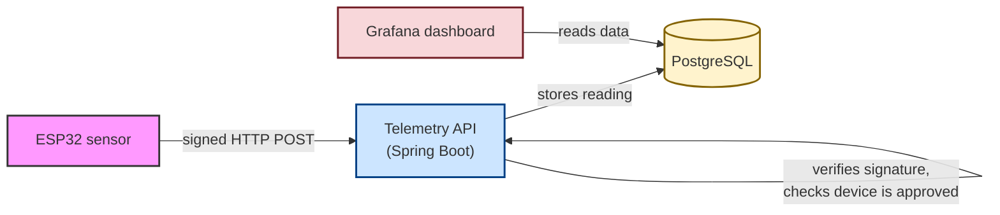
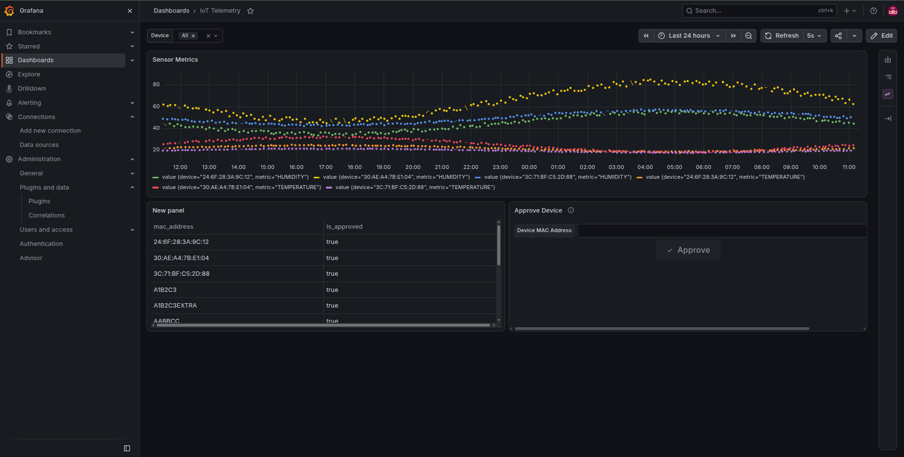
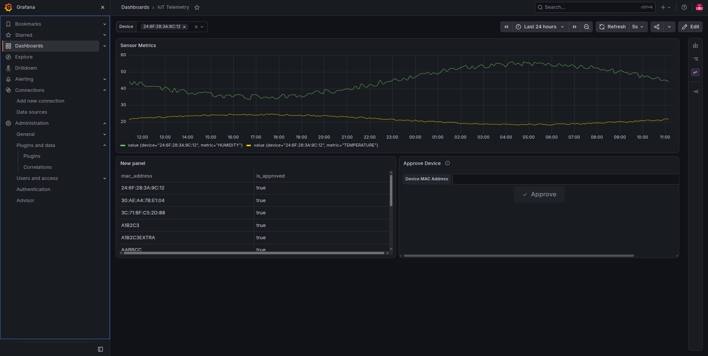

# IoT Telemetry Pipeline

An end-to-end IoT telemetry pipeline: ESP32 sensors (temperature & humidity) send readings to a backend API, the readings land in a database, and a live dashboard shows what's happening. Same basic shape as a real industrial or home monitoring setup.

## What it actually does

1. A sensor registers itself with a MAC address and a shared secret.
2. An admin has to approve the device before it's allowed to send any data, so a random device can't just start pushing readings.
3. Once approved, the device sends temperature/humidity readings signed with its secret (HMAC), so the API can verify the data really came from that device and wasn't tampered with.
4. Readings land in PostgreSQL.
5. Grafana reads straight from the database and shows the data live, with a filter to pick a single sensor or look at all of them at once.

## How it's put together



Today this all runs locally with Docker Compose: API, database, and Grafana each in their own container.

### Work in progress: cloud deployment

There's a Terraform sketch in `terraform/` for eventually running this for real on Google Cloud's free tier (a tiny VM for the database/dashboard, serverless Cloud Run for the API). It's not deployed yet - right now it's just the plan.

## The dashboard

Here's what it looks like with three sensors reporting over 24 hours:



And filtered down to just one device, using the dropdown at the top:



The panel on the right lets an admin approve a newly-registered device straight from the dashboard, without needing a separate admin tool.

## A few things I cared about getting right

- **Devices aren't trusted by default.** A new device has to be explicitly approved before its data is accepted, and every reading has to carry a valid signature made with that device's own secret. This mirrors how you'd want to treat any device sending data in from the internet.
- **It should be easy to run from scratch.** One `docker compose up`, and the API, database, and a pre-configured Grafana dashboard are all up and talking to each other.

## Tech stack

| Layer | What's used |
|---|---|
| Ingestion API | Java, Spring Boot |
| Database | PostgreSQL |
| Dashboard | Grafana |
| Local environment | Docker Compose |
| Planned cloud deployment | Terraform, Google Cloud (Cloud Run + Compute Engine) |

## Running it yourself

For now the API's Dockerfile just copies a pre-built jar rather than building from source, so build it by hand first:

```bash
cd server
./gradlew build
cd ..
```

Then:

```bash
cp .env.example .env   # fill in your own DB/Grafana credentials
docker compose up -d
```

Then open Grafana at `http://localhost:3000`.